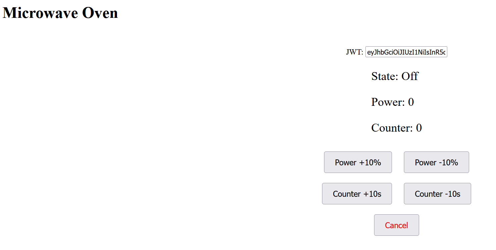
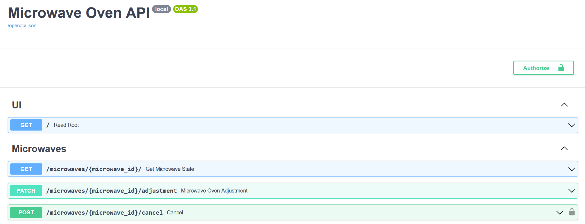

## Microwave Oven

Create a simple web application using FastAPI and a distributed cache/state (Redis or any other) that simulates the
operation of a microwave in an office kitchen. Upon accessing the website, the user should see the microwave and its
current state (On/Off, Power, Counter). The microwave should also have the following buttons: Power +10%, Power -10%,
Counter +10s, Counter -10s, Cancel. Each button can be pressed by anyone, except the Cancel button, which requires a JWT
token for validation. Requirements:

* Use FastAPI framework to build the web application.
* Implement Pull methods to fetch current state. (Bonus: implement websockets to allow real-time updates of the
  microwave state across all client sessions.)
* Utilize a distributed cache or state storage mechanism (such as Redis) to store and share the microwave state.
* For user actions you can use REST API
* Implement JWT token validation for the Cancel button. For simplicity, you can obtain a token from the jwt.io website
  with an HS256 signature and a simple secret.
* Design and implement the simplest user interface to display the microwave and its state, as well as the buttons for
  power, counter adjustments, cancel and state (Microwave is ON when Power or Counter are greater than zero).

Use .env file with:

```
API_VERSION=local  
DEBUG=True  
ENV=dev  
DB_HOST=redis  
DB_PORT=6379  
JWT_SECRET=dsbu23kjgfd8923DSFL43ds342Djbkrew89
```

To start up use:

```
docker compose up
```

After start up use:

APP: http://localhost:5000/  
DOCS: http://localhost:5000/docs

APP:


DOCS:
